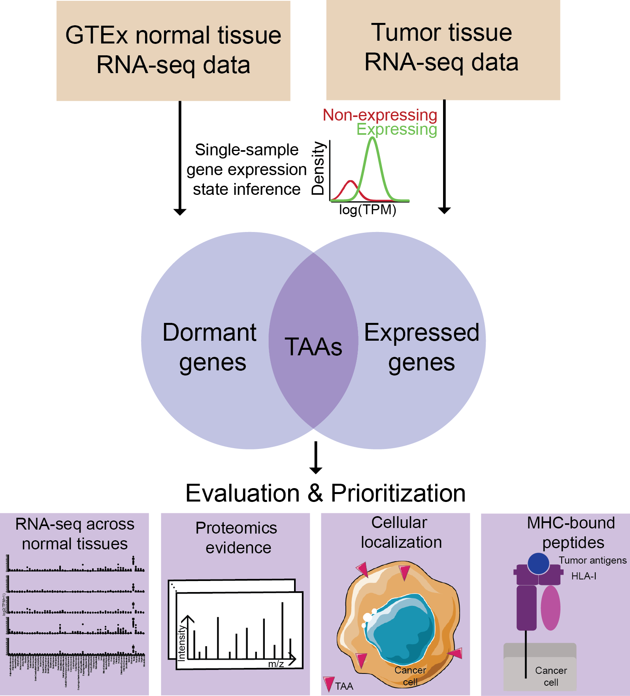

# Tumor-associated antigen prediction using a single-sample gene expression state inference algorithm



**Tumor-associated antigens (TAAs)**, which are scarcely present in normal tissues but notably elevated in tumors, hold significant promise for immunotherapy. Gene expression databases such as Gene Expression Omnibus (GTEx) for normal tissues and Cancer Genome Atlas (TCGA) for tumor tissues enable systematic evaluation of gene expression states in both normal and cancerous conditions, facilitating the identification of TAAs. Existing statistical methods focus on tissue-level gene expression state inference, limiting their utility in identifying specific tumors for personalized treatments. Conversely, single-sample analysis often relies on a fixed threshold method, which struggles to effectively handle measurement noise. To overcome these challenges, we developed a novel Bayesian algorithm for inferring gene expression states in individual samples, which outperformed the fixed threshold method in our comparative evaluation. We incorporated this algorithm into a computational workflow to identify candidate TAAs and associated tumor samples. Applying this workflow to RNA-seq data from GTEx and TCGA, we identified **212 candidate TAAs across 33 cancer types**, 78 of which showed significant expression in multiple cancer types. Validation in an independent liver cancer cohort confirmed 48 of the 54 TAAs predicted from TCGA liver cancer data, with 10 further corroborated through proteomics. We computationally predicted that 38 peptide sequences derived from these 10 TAAs would have a high binding affinity for HLA-A02, the most prevalent HLA allele in humans. Experimental validation confirmed significant binding affinity and immunogenicity for 21 of these peptides. In both TCGA and the independent cohort, about 64% of samples expressed one or more TAAs associated with these 21 peptides, making them promising candidates for developing peptide vaccines or TCR-T cell-based therapies targeting liver cancer. This study underscores the effectiveness of combining computational analyses with experimental validations in discovering and confirming TAAs for immunotherapy.

## Contents

- [Directory structure of TAAPrediction](#directory-structure-of-taaprediction)
- [Usage](#usage)
  - [Download example data](#download-example-data)
  - [Run TAAPrediction](#run-taaprediction)
- [Output](#output)
- [Contact](#contact)
- [References](#references)

## Directory structure of DeepRescore2
```
DeepRescore2
|---Script
|---|---1.GTExExpressionStateInference
|---|---2.TCGAExpressionStateInference
|---|---3.HCCExpressionStateInference
|---|---4.DormantGenePrediction.R
|---|---5.CancerGenePrediction_TCGA.R
|---|---6.CancerGenePrediction_HCC.R
```
- **Script** implements TAAPrediction to identify candidate TAAs and associated tumor samples.

## Usage

### Download example data
- Please go to https://zenodo.org/records/10049730 and download **GTExTissueData.zip (54 normal tissue RNA-seq data)**, **TCGATumorTissueData.zip (33 tumor tissues RNA-seq data)**, **HCCTumorTissueData.zip (HCC tumor tissue RNA-seq data)** used in our manuscript. Unzip these files as the input for TAAPrediction. 

### Run TAAPrediction
- Please open the program files in order, modify the input file paths, and run using the R language

## Output

TAAPrediction will output results of each step, including
* GTEx_ExpressPosterior
* TCGA_ExpressPosterior
* HCC_ExpressPosterior
* Data_GTEx_ExpressMatrix
* Data_TCGA_ExpressMatrix
* Data_HCC_ExpressMatrix
* MaxTPMForCertainProbability_GTEx
* MaxTPMForCertainProbability_TCGA
* MaxTPMForCertainProbability_HCC
* Data_DormantGenes
* Data_CancerGenes_TCGA
* Data_CancerGenes_HCC

## Contact

Xinpei Yi - [@yixinpei](https://twitter.com/yixinpei) - yixinpei13@gmail.com
<br/>Project Link: [https://github.com/bzhanglab/DeepRescore2](https://github.com/bzhanglab/DeepRescore2)
<br/>Lab Website: [bingzhang-Lab BCM](https://www.zhang-lab.org/)

## References
